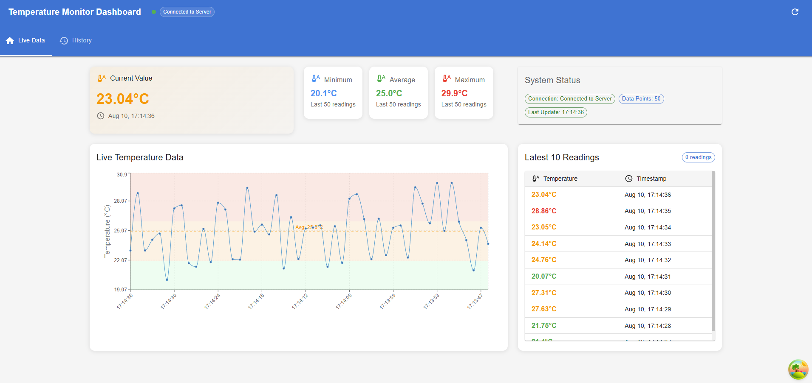
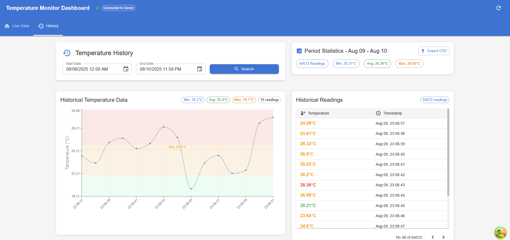

# Sensor Data Display Dashboard

A real-time sensor data display dashboard project that captures, stores, and visualizes temperature readings emitted by a simulated sensor.

---

## Project Structure

This project consists of three main sections:

- **data-emitter-backend**: Simulates a sensor emitting temperature readings once every second using `socket.io`.
- **backend**: Receives data from the emitter, captures and stores temperature readings in a MongoDB database.
- **frontend**: A React application created with Vite, which connects to the backend via WebSocket and displays live and historical temperature data.

---

## Installation and Running the Project

### Prerequisites

- Node.js (v16 or higher)
- MongoDB (local or cloud instance)
- Git

### Setup Instructions

1. **Clone the repository**
   ```bash
   git clone <your-repo-url>
   cd sensor-data-display-dashboard
   ```

2. **Start the data-emitter-backend**
   ```bash
   cd data-emitter-backend
   npm install
   npm start
   ```

3. **Start the backend**
   ```bash
   cd ../backend
   npm install
   npm start
   ```

4. **Start the frontend**
   ```bash
   cd ../frontend
   npm install
   npm run dev
   ```

---

## How it Works

1. The **data-emitter-backend** simulates a sensor by emitting a temperature reading every second through Socket.io.

2. The **backend** listens for these readings, processes them, and stores them in a MongoDB database.

3. The **frontend** connects to the backend via WebSocket, enabling real-time updates and fetching historical data on demand.

---

## Features

### Live Data View (Home Page)
Displays the most recent temperature readings in a table alongside a real-time updating graph.



### Historical Data View (History Page)
Allows the user to select a start and end date, fetches paginated historical data (15 readings per page), and displays it in both a table and a graph for easy analysis.



---

## Technology Stack

- **Frontend**: React 18, Vite, Socket.IO Client
- **Backend**: Node.js, Express.js, Socket.IO, MongoDB, Mongoose
- **Data Emitter**: Node.js, Socket.IO
- **Database**: MongoDB

---

## Development

This project was developed entirely by a single developer, demonstrating full-stack development capabilities including real-time data processing, database integration, and modern React development patterns.